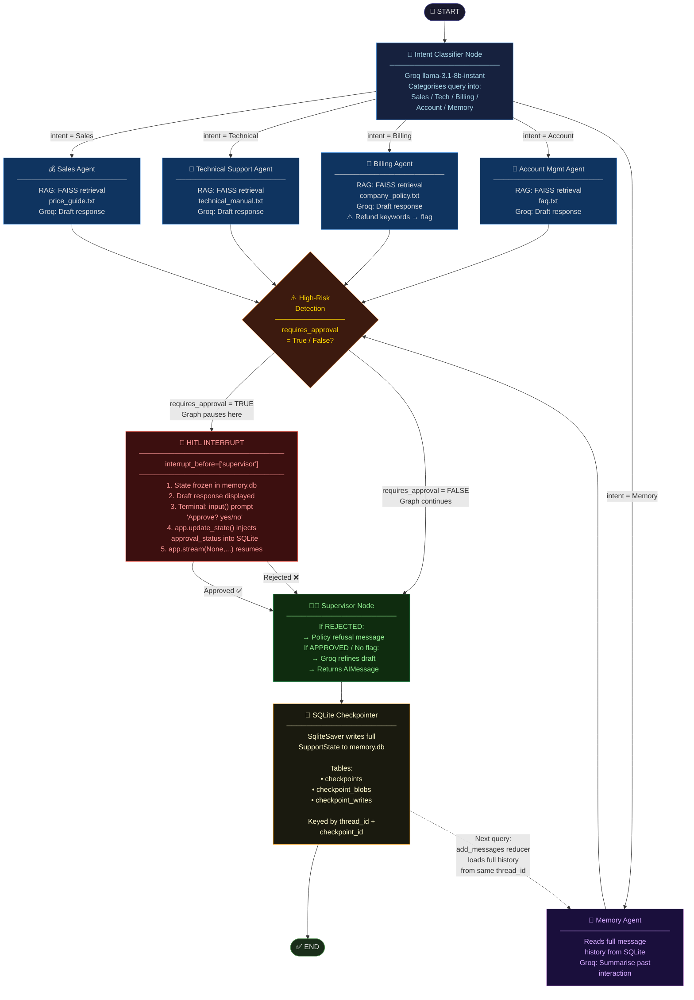

# LangGraph Workflow Diagram — Customer Support Multi-Agent System

Paste the code block below into [Mermaid Live Editor](https://mermaid.live) to render the interactive diagram.



## Node Reference Table

| Node | Role | Model/Tech |
|---|---|---|
| **Intent Classifier** | Routes query to correct department | Groq `llama-3.1-8b-instant` |
| **Sales Agent** | Answers pricing & plan questions | FAISS + Gemini Embeddings + Groq |
| **Technical Agent** | Resolves application errors & bugs | FAISS + Gemini Embeddings + Groq |
| **Billing Agent** | Handles invoices, refunds, subscriptions | FAISS + Gemini Embeddings + Groq |
| **Account Agent** | Manages passwords, profiles, login | FAISS + Gemini Embeddings + Groq |
| **Memory Agent** | Recalls prior interactions from history | SQLite message history + Groq |
| **High-Risk Check** | Detects refund/cancel/escalate keywords | Python keyword scan (no LLM) |
| **HITL Interrupt** | Pauses graph; collects human decision | `interrupt_before` + `input()` + `update_state()` |
| **Supervisor Node** | Finalises or refuses based on approval | Groq `llama-3.1-8b-instant` |
| **SQLite Checkpointer** | Persists full state after every node | `SqliteSaver` → `memory.db` |

## Key LangGraph Primitives Used

```python
# 1. add_messages reducer — appends instead of overwrites
messages: Annotated[list, add_messages]

# 2. Conditional routing — maps intent to node names
builder.add_conditional_edges("classifier", route_intent)

# 3. HITL interrupt — pauses graph before supervisor
app = builder.compile(checkpointer=memory, interrupt_before=["supervisor"])

# 4. Read paused state
current_state = app.get_state(thread_config)

# 5. Inject human decision into frozen checkpoint
app.update_state(thread_config, {"approval_status": "approved"}, as_node="supervisor")

# 6. Resume from frozen checkpoint
for event in app.stream(None, config=thread_config):
    pass
```
